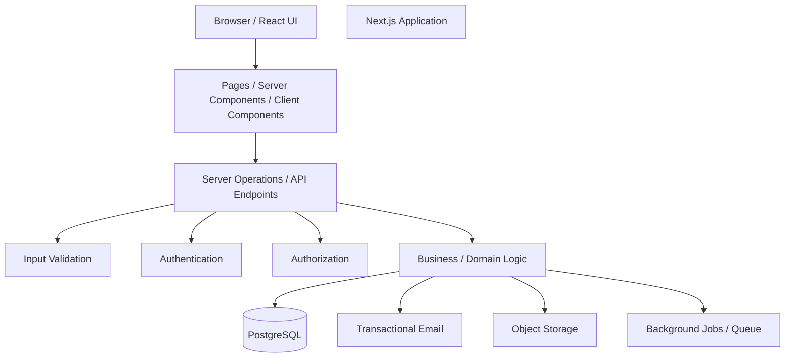

# SaaSFlow Architecture

## 1. Purpose

This document describes the first high-level architecture of SaaSFlow.

It is an initial design. It is expected to evolve as implementation reveals new requirements.

## 2. Architecture Overview



## 3. Request Flow

A typical request should conceptually follow:

```text
Browser
   |
   v
Next.js
   |
   v
Authentication
   |
   v
Authorization
   |
   v
Input Validation
   |
   v
Business / Domain Logic
   |
   v
Database / External Service
   |
   v
Response
   |
   v
Browser
```

## 3.1 Server Operations

Domain mutations use Next.js Route Handlers under `app/api` and follow this
server-side order:

```text
Request JSON
        |
        v
Input validation and normalization
        |
        v
Better Auth session resolution
        |
        v
Workspace membership and permission checks
        |
        v
Business operation orchestration
        |
        v
Data access layer
        |
        v
PostgreSQL
        |
        v
Safe JSON response
```

Current server-operation endpoints are:

- `POST /api/workspaces`
- `PATCH /api/workspaces/:workspaceId`
- `DELETE /api/workspaces/:workspaceId`
- `GET /api/workspaces/:workspaceId/members`
- `PATCH /api/workspaces/:workspaceId/members`
- `DELETE /api/workspaces/:workspaceId/members`
- `GET /api/projects?workspaceId=...`
- `POST /api/projects`
- `PATCH /api/projects/:projectId`
- `DELETE /api/projects/:projectId`
- `GET /api/tasks?projectId=...`
- `POST /api/tasks`
- `PATCH /api/tasks/:taskId`
- `DELETE /api/tasks/:taskId`
- `POST /api/comments`
- `DELETE /api/comments/:commentId`

The route handlers own request parsing and safe error responses. Server
operations own validation, session resolution, authorization orchestration,
and calls to the data layer. The data layer owns PostgreSQL persistence and
workspace/resource queries. Client-provided user IDs are never used to set
resource ownership.

## 4. Main Components

### Browser / UI

Responsible for:
- Displaying application pages
- Forms
- User interactions
- Client-side interactions where required
- Loading, empty, and error states

The UI should not be considered the security boundary.

### Next.js Application

Responsible for:
- Application routes
- Pages
- Server Components
- Client Components when needed
- Server-side operations
- API endpoints where appropriate
- Connecting the application layers

### Validation

Responsible for:
- Validating untrusted input
- Checking request data before business operations
- Returning useful validation errors

The roadmap recommends Zod for validation, but the library should be introduced when its phase is reached.

### Authentication

Responsible for:
- Identifying the current user
- Registration
- Login
- Sessions
- Logout
- Later: email verification and password reset

A maintained authentication solution should be researched before selection.

### Authorization

Responsible for:
- Checking workspace membership
- Checking workspace roles
- Checking resource ownership
- Enforcing permissions on server-side mutations and queries
- Preventing cross-workspace access

### Business / Domain Logic

Responsible for application rules.

Examples:
- Create workspace
- Invite member
- Create project
- Create task
- Assign task
- Change task status
- Add comment

Business logic should not depend directly on UI components.

### PostgreSQL

Responsible for persistent relational data:

- Users
- Workspaces
- Memberships
- Projects
- Tasks
- Comments
- Labels
- TaskLabels
- Attachments metadata
- Invitations
- Activity

### External Services

The production system may use:

- Transactional email
- Object storage for attachments
- Background job/queue infrastructure

These should be introduced when the corresponding project phases are reached.

## 5. Multi-Tenancy Model

Workspace is the tenant boundary.

Conceptually:

```text
                    SaaSFlow
                       |
          +------------+------------+
          |                         |
     Workspace A               Workspace B
          |                         |
      Members A                 Members B
          |                         |
      Projects A               Projects B
          |                         |
       Tasks A                  Tasks B
```

A user may belong to multiple workspaces:

```text
User
 | |  v  v
WA  WB
```

The application must verify the user's membership and permissions before returning or modifying workspace resources.

## 6. Security Boundary

The UI is not the security boundary.

For example, hiding a "Delete Project" button from a MEMBER is not enough.

The server must also reject:

```text
MEMBER -> deleteProject(...)
```

when that operation is not permitted.

Likewise, a request such as:

```text
GET /workspace-B/project-123
```

must verify that the current user has access to Workspace B before returning the resource.

## 7. Data Flow Example

Example: creating a task.

```text
User submits "Create Task"
        |
        v
Browser
        |
        v
Next.js server operation
        |
        v
Authenticate user
        |
        v
Check workspace membership
        |
        v
Check permission
        |
        v
Validate task input
        |
        v
Business logic
        |
        v
PostgreSQL
        |
        v
Return created task
        |
        v
Update UI
```

## 8. Initial Technology Direction

The roadmap proposes:

- Next.js
- React
- TypeScript
- Tailwind CSS
- shadcn/ui
- PostgreSQL
- Prisma ORM
- Authentication library
- Zod
- Vitest
- Playwright
- Git + GitHub
- Production hosting such as Vercel
- Object storage
- Transactional email
- Background-job/queue solution

These technologies should not all be installed at the beginning. Each should be introduced when the project reaches the problem it solves.

## 9. Architecture Principles

1. Keep the browser/UI separate from server-side business logic.
2. Validate untrusted input on the server.
3. Enforce authorization on the server.
4. Keep workspace data isolated.
5. Keep database access separated from UI components.
6. Introduce infrastructure when it becomes necessary.
7. Prefer simple architecture first and evolve it with real requirements.
8. Document important architectural decisions.

## 10. Open Architecture Questions

- Which authentication solution should be selected?
- Which operations should use API endpoints versus server-side application mechanisms?
- Where should domain services live?
- Which external providers should be used for email and object storage?
- Which background-job solution should be used?
- What hosting/deployment architecture should be used?
